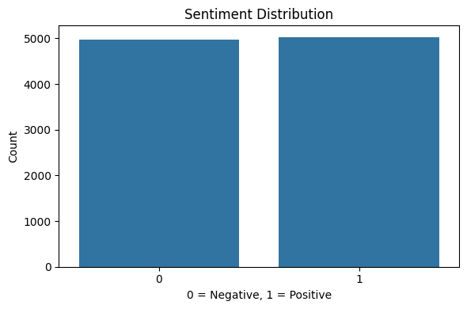
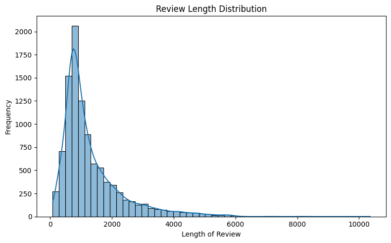

# 🎬 Sentiment Analysis on Movie Reviews

This project analyzes movie reviews and classifies them as positive or negative using Natural Language Processing (NLP) and Machine Learning techniques.

## 📈 What’s Inside?

📊 Sentiment Distribution: Count of positive vs negative reviews
📉 Review Length Distribution

🤖 Machine Learning Model: Logistic Regression

## 📦 Dataset

IMDB Movie Reviews Dataset

## 🔧 Tools & Libraries Used

* Python
* Pandas
* Matplotlib
* Seaborn
* Scikit-learn
* NLTK

## 📸 Outputs




## 🚀 Model Performance

Accuracy: ~89%

## 🚀 How to Run

1. Install required libraries:

```
pip install pandas matplotlib seaborn scikit-learn nltk
```

2. Run the project:

```
python sentiment_analysis.py
```

## 🧠 Project Workflow

* Data preprocessing and text cleaning
* Exploratory Data Analysis (EDA)
* Feature extraction using TF-IDF
* Model training using Logistic Regression
* Model evaluation using accuracy and classification report

## 🙌 Contributions

Open to suggestions or improvements — feel free to fork and submit pull requests.
